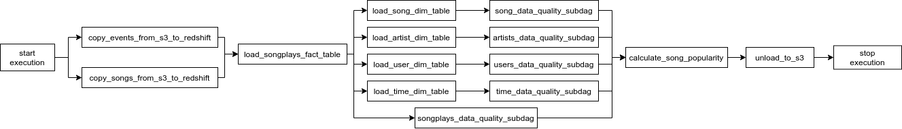

## Production Data Pipeline

**Data Pipeline design**:

1. Extract data from multiple S3 locations.
2. Load the data into Redshift cluster.
3. Transform the data into a star schema.
4. Perform data validation and data quality checks.
5. Calculate the most played songs for the specified time interval.
6. Load the result back into S3.

Credit: Udacity Data Engineering Project
